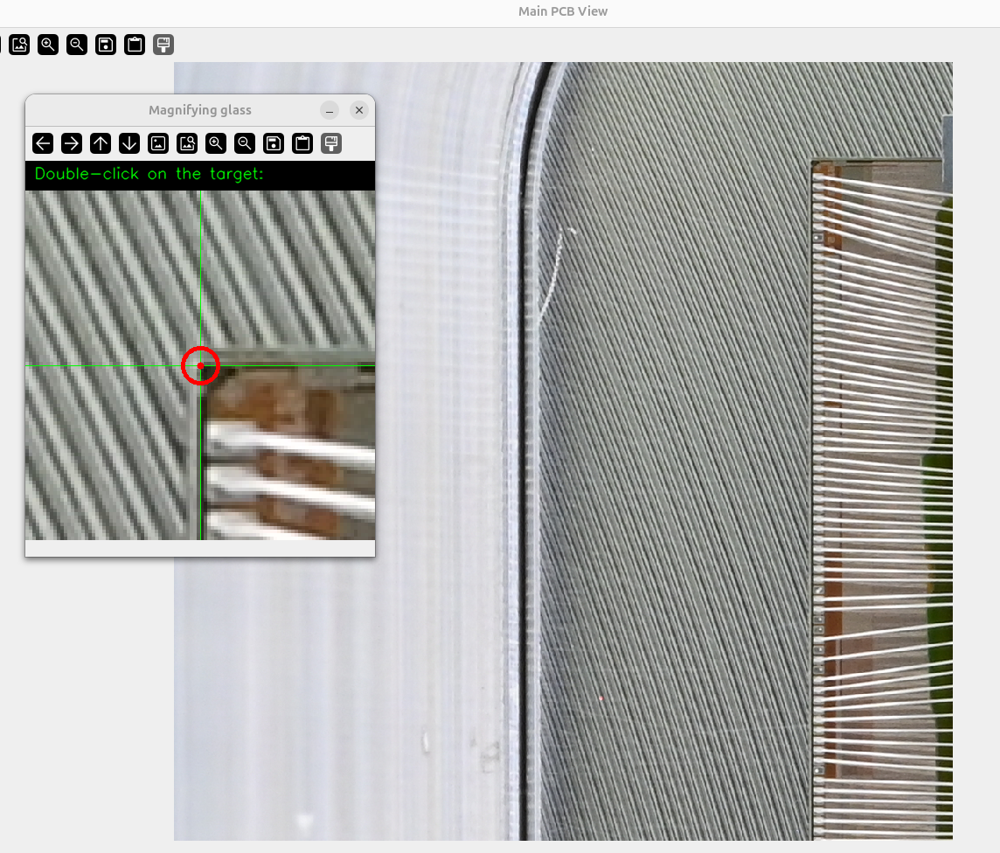

# PCB Defects Detection – ATLAS

> ⚠️ **Disclaimer** : cette application est actuellement en **version de test**. Des bugs ou comportements inattendus peuvent survenir. N'hésitez pas à nous en faire part afin que nous puissions les corriger !

Application Python développée pour le CEA dans le cadre de l'upgrade du détecteur **ATLAS** au CERN. Elle a pour objectif d'**assister l'utilisateur dans la vérification du câblage** des modules, en mettant en évidence les zones dignes d'intérêt (fils manquants, courts-circuits, erreurs de câblage, etc.) à partir de deux photographies du module (avant et après câblage).

⚠️ Le programme n'est pas infaillible et produira certainement des erreurs, essentiellement des **faux positifs**. Il s'agit d'un outil d'aide à la décision, la vérification finale revenant à l'utilisateur.

---

## Sommaire

- [Installation](#installation)
- [Activation de l'environnement virtuel](#activation-de-lenvironnement-virtuel)
- [Préparation des données](#préparation-des-données)
- [Utilisation](#utilisation)
- [Sélection des coins du chip](#sélection-des-coins-du-chip)
- [Bilan affiché dans le terminal](#bilan-affiché-dans-le-terminal)
- [Visualisation interactive](#visualisation-interactive)
- [Configuration (config.json)](#configuration-configjson)
- [Modifier la configuration en ligne de commande](#modifier-la-configuration-en-ligne-de-commande)
- [Arguments de la commande `check`](#arguments-de-la-commande-check)
- [Numérotation des pistes et des pads](#numérotation-des-pistes-et-des-pads)

---

## Installation

> À faire **une seule fois par machine**.

L'application est hébergée sur GitHub. Ouvrez un terminal et clonez le dépôt :

**Via SSH :**

```bash
git clone git@github.com:GabrielVandersippe/pcb_defects_detection_ATLAS.git
```

**Via HTTPS :**

```bash
git clone https://github.com/GabrielVandersippe/pcb_defects_detection_ATLAS.git
```

### Installation de l'environnement virtuel

> À faire **une seule fois par machine** également.

1. Installer [Poetry](https://python-poetry.org/).
2. Ouvrir un terminal dans le dossier contenant le package (le dossier cloné à l'étape précédente).
3. Exécuter :
   ```bash
   poetry install
   ```

---

## Activation de l'environnement virtuel

> À faire **une fois par session de travail**.

1. Ouvrir un terminal et entrer :
   - avec Git Bash

   ```bash
   eval $(poetry env activate)
   ```

   - avec Powershell

   ```powershell
   Invoke-Expression (poetry env activate)
   ```

2. Si la commande renvoie un message du type :

   ```
   You must source this script: $ source chemin/vers/python
   ```

   il faut copier-coller la commande proposée, par exemple :

   ```bash
   source chemin/vers/python
   ```

   ⚠️ Attention : il arrive que le chemin proposé utilise des `\` au lieu de `/`. Dans ce cas, remplacez-les manuellement avant d'exécuter la commande.

   Si la commande `source` n'est pas reconnue, elle peut être installée avec :

   ```bash
   pip install source
   ```

3. Pour les autres types de terminaux, se référer à la documentation officielle de Poetry :
   [https://python-poetry.org/docs/managing-environments/](https://python-poetry.org/docs/managing-environments/)

4. Pour vérifier que l'environnement virtuel est bien activé :
   ```bash
   which python
   ```
   Cette commande doit renvoyer le chemin vers la version de Python de l'environnement virtuel (et non celle du système).

---

## Préparation des données

Avant de lancer une analyse, il faut :

1. **Placer 2 images** du module dans le dossier indiqué par [`pictures_folder`](#pictures_folder) dans `config.json` (par défaut : `ModulePictures`) :
   - une image du module **non câblé**,
   - une image du module **câblé**.

2. **Renseigner les 4 valeurs d'iref** du module, soit :
   - dans le fichier `pcb_defect_detector/reference/iref_trim_per_module_v2`,
   - soit directement dans la commande via l'argument `--iref` (voir [plus bas](#arguments-de-la-commande-check)).

---

## Utilisation

Se placer dans le dossier `pcb_defect_detector` avec le terminal, puis lancer :

```bash
python main.py check --input nom_du_fichier_cablé
```

L'argument `--input` accepte plusieurs formats :

| Format accepté                                  | Exemple                            |
| ----------------------------------------------- | ---------------------------------- |
| Chemin complet du fichier                       | `/chemin/vers/mon_fichier.png`     |
| Nom complet du fichier (avec ou sans extension) | `mon_fichier.png` ou `mon_fichier` |
| Numéro de série du module                       | `20UPGM...`                        |
| Identifiant alternatif du module                | `P...`                             |

---

## Sélection des coins du chip

Après le lancement de la commande, quelques secondes sont nécessaires avant que le programme ne demande de **sélectionner les 4 coins du chip** sur la photo du module câblé.

Une loupe s'affiche pour faciliter le repérage précis du coin, comme illustré ci-dessous :



Pour chaque coin :

1. **Double-cliquer** sur l'endroit correspondant au coin sombre du chip.
2. Si la sélection n'est pas satisfaisante, il suffit de **double-cliquer ailleurs** pour la corriger.
3. Une fois le coin sélectionné, appuyer sur **`q`** pour valider.
4. Faire la même chose pour les 4 coins.

Le programme lance alors les calculs. Il ne reste plus qu'à attendre la fin de l'analyse.

---

## Bilan affiché dans le terminal

À la fin des calculs, un bilan complet s'affiche dans le terminal, comprenant :

- le **nombre de fils attendus et lus**, avec les éventuels numéros de pads (format `XYYY`, où `X` est le numéro du chip et `YYY` le numéro du pad sur ce chip) des fils manquants ;
- le **nombre de courts-circuits non critiques** (concernant une seule piste de cuivre) détectés à droite et à gauche, avec les numéros de pads concernés ;
- le **nombre de courts-circuits critiques** (concernant plusieurs pistes de cuivre) détectés à droite et à gauche, avec les numéros de pads concernés ;
- le **nombre de fils mal câblés côté chip**, avec les numéros de pads concernés ;
- le **nombre de fils mal câblés côté PCB**, avec les numéros de pads concernés ;
- les **irefs attendus et lus**.

---

## Visualisation interactive

À la fin des calculs, une image du module s'affiche également. Il est possible de naviguer entre plusieurs vues à l'aide des touches suivantes :

| Touche | Vue affichée                                 |
| ------ | -------------------------------------------- |
| `1`    | Vue non modifiée                             |
| `2`    | Courts-circuits critiques                    |
| `3`    | Courts-circuits non critiques                |
| `4`    | Extrémités des fils mal câblés               |
| `5`    | Extrémités de tous les fils                  |
| `6`    | Zones de pistes de cuivre et de pads du chip |

Le dernier résultat affiché peut, une fois fermé, être rouvert via la commande `show`, c'est à dire en exécutant:

```bash
python main.py show
```

---

## Configuration (config.json)

Le fichier `config.json` permet de personnaliser le comportement de l'application. Chaque option peut également être modifiée directement en ligne de commande via la [commande `config`](#modifier-la-configuration-en-ligne-de-commande).

#### `pictures_folder`

Chemin du répertoire contenant les images des modules.

#### `pictures_format`

Format des images utilisées.

#### `language`

Langue de l'application : `"fr"` (français) ou `"en"` (anglais).

#### `suffix_after_bonding`

Suffixe (ou liste de suffixes, partiels ou complets) des images du module **câblé**.

#### `suffix_before_bonding`

Suffixe (ou liste de suffixes, partiels ou complets) des images du module **non câblé**.

#### `verbose`

Niveau de détail des informations affichées dans le terminal (de `0` à `3`).

#### `zoom_select`

Puissance du zoom de la loupe pour la sélection des coins et des mires (`4` par défaut, `1` = pas de zoom).

#### `zoom_visualize`

Puissance du zoom de la loupe pour la visualisation des résultats (`2` par défaut, `1` = pas de zoom).

#### `aggressiveness_level`

Niveau d'agressivité de l'algorithme de détection : `"low"`, `"medium"` ou `"high"`. Un niveau plus agressif augmente le nombre de faux positifs mais réduit le risque de faux négatifs. Des niveaux personnalisés peuvent être créés dans `aggressiveness_config.json`.

#### `size_window`

Mode de définition de la taille initiale de la fenêtre : `"normal"` ou `"auto"` (à adapter en fonction de l'écran).

---

## Modifier la configuration en ligne de commande

En plus d'une édition manuelle du fichier `config.json`, une commande `config` permet de modifier certaines options directement depuis le terminal :

```bash
python main.py config --folder ModulePictures
```

| Argument           | Option modifiée dans `config.json`                  |
| ------------------ | --------------------------------------------------- |
| `--folder`         | [`pictures_folder`](#pictures_folder)               |
| `--format`         | [`pictures_format`](#pictures_format)               |
| `--language`       | [`language`](#language)                             |
| `--suffix-after`   | [`suffix_after_bonding`](#suffix_after_bonding)     |
| `--suffix-before`  | [`suffix_before_bonding`](#suffix_before_bonding)   |
| `--verbose`        | [`verbose`](#verbose)                               |
| `--zoom-select`    | [`zoom_select`](#zoom_select)                       |
| `--zoom-visualize` | [`zoom_visualize`](#zoom_visualize)                 |
| `--show`           | Affiche la configuration actuelle (ne modifie rien) |

**Exemple :**

```bash
python main.py config --language en --zoom 2 --verbose 0
```

Pour simplement consulter la configuration actuelle sans la modifier :

```bash
python main.py config --show
```

---

## Arguments de la commande `check`

En complément (ou à la place) des options de `config.json`, les arguments suivants peuvent être passés directement à la commande `check` :

| Argument                 | Description                                                                                                                                                                                                                         |
| ------------------------ | ----------------------------------------------------------------------------------------------------------------------------------------------------------------------------------------------------------------------------------- |
| `--iref`                 | Indique les 4 valeurs d'iref (4 entiers séparés par des virgules)                                                                                                                                                                   |
| `--verbose`              | Indique un niveau de verbosité (remplace la valeur de `config.json`)                                                                                                                                                                |
| `--aggressiveness`       | Indique un niveau d'agressivité (remplace la valeur de `config.json`)                                                                                                                                                               |
| `--override-targets`     | Permet de faire la sélection des mires du circuit imprimé à la main. Peut résoudre des problèmes lorsque la détection automatique est imprécise. NOTE: Dans ce cas, il est nécessaire de sélectionner les mires de **HAUT EN BAS**. |
| `--full-image-selection` | Permet de faire la sélection des coins et des mires sur l'intégralité de l'image. Peut être utile dans le cas de figure où l'image est mal centrée.                                                                                 |
| `--skip-pulltest`        | Réalise la vérification en considérant que le module n'a plus ses fils de pulltest.                                                                                                                                                 |
| `--read-corners`         | Lit la position des coins du chip dans le fichier ModuleData/corners_pos.json.                                                                                                                                                      |
| `--read-targets`         | Lit la position des mires dans le fichier ModuleData/targets_pos.json.                                                                                                                                                              |

**Exemple :**

```bash
python main.py check --input 20UPGM00012345 --iref 10,10,9,5 --aggressiveness high
```

---

## Afficher les derniers résultats

La commande show permet d'afficher la vue avec loupe du dernier module analysé :

```bash
python main.py show
```

---

## Numérotation des pistes et des pads

Des informations détaillées sur la numérotation des pistes de cuivre et des pads du chip sont disponibles dans le document :

📄 `docs/bounding_map.pdf`
